如果光有声音
======

——拓竹杯·清华大学第七届软件开发大赛 特等奖作品

## 游戏简介
《如果光有声音》是一款治愈系2D音乐解谜游戏。玩家通过隐藏在音乐中的线索提示，操纵艾尔塔拉按照一定顺序和时间间隔踩击琴键，复述、补全、倒放音乐或改变音调高低，解锁机关，点亮迷宫各个角落，找寻到遗失的长明灯，走出迷宫。  

背景音乐-开始: https://github.com/zr-zhou0o0/light/blob/main/Assets/music/bgmStart.wav

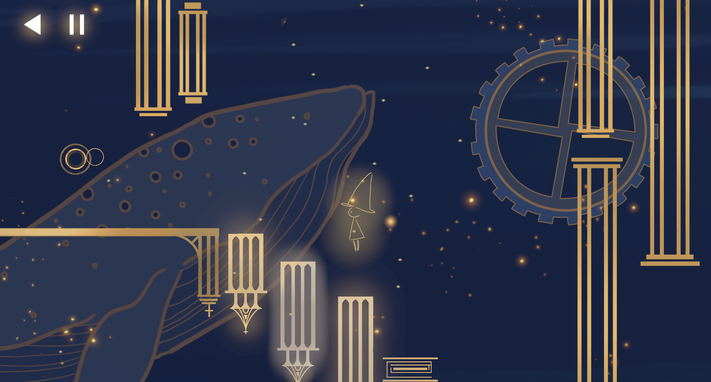
（示例：天空）

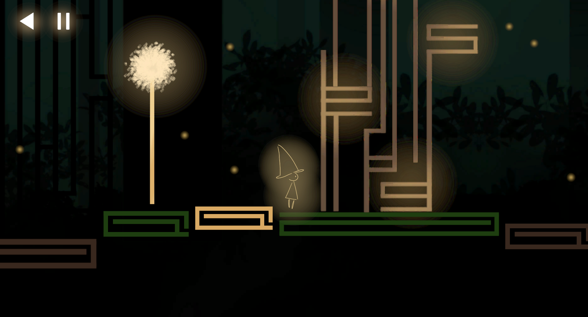
（示例：森林）

## 游戏类型
治愈系 音乐解谜游戏

## 创意来源
纪念碑谷、雨纪

## 故事背景
这是一个光与声音的世界，一切秩序都由光芒与旋律书写。然而世界稳态逐渐磨损，光芒式微，旋律不再…
你叫艾尔塔拉，你将利用周围小小的光芒，弹奏出解开周遭机巧的旋律，找寻到遗失的长明灯，走出迷宫。
随着迷宫各处被点亮，世界的真相将逐渐展现在你面前。

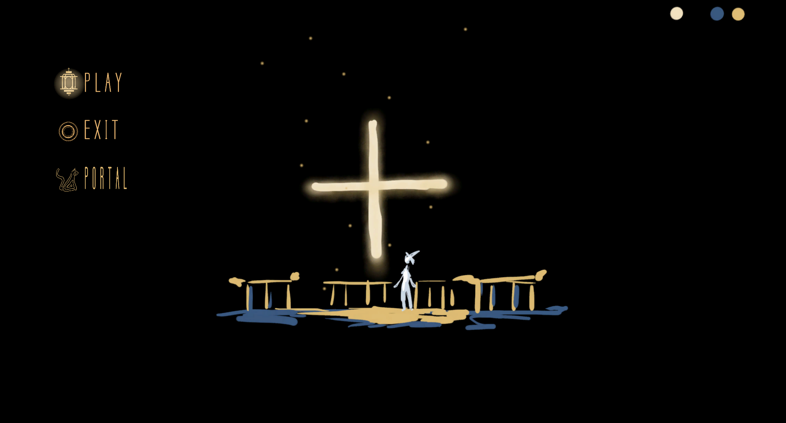
天空：十字架象征救赎。艾尔塔拉在天空迷宫中醒来，点亮三盏长明灯，由天空中坠落。  
  
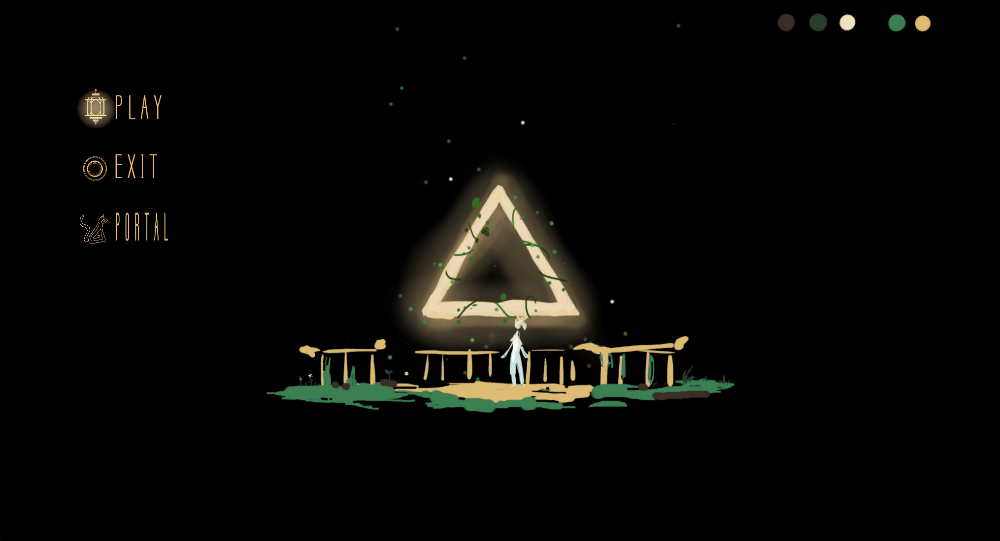
森林：三角形象征失序。艾尔塔拉坠入迷雾森林，未知的危险让艾尔塔拉的每一步必须小心翼翼。艾尔塔拉在迷宫的角落沉沉睡去。  
  
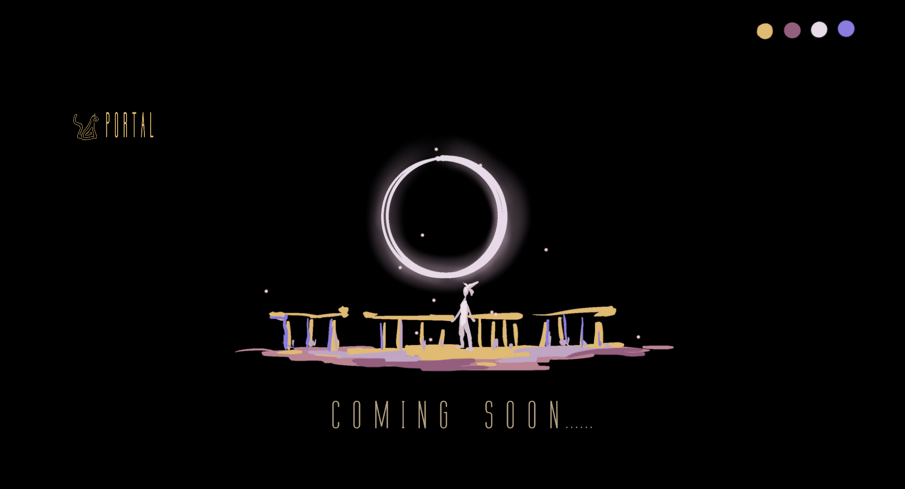
梦境：圆形象征轮回。睡去的艾尔塔拉在梦境中寻找出口……  
  

## 玩法机制
**音乐解谜方法**：通过寻找背景音乐中隐藏的线索以及迷宫中“可发声的琴键”的规律，解锁各种机关。这些隐藏的线索包括但不限于：复述、补全、倒放音乐，改变音调高低，解读音乐隐喻。每个“可发声的琴键”都有固定的声音。  
玩家（艾尔塔拉）：玩家通过键盘和鼠标控制艾尔塔拉左右移动、跳跃以及机关的激活。
琴键：艾尔塔拉踩击琴键可发出声音，可以解锁迷宫。琴键有时可以移动。  
光点：有时壁灯或者蒲公英中会暗含光点，光点可以激活机关，也可以点亮长明灯。  
光场：被点亮后可以给艾尔塔拉一个向上的力。  
光线：有的琴键被激活后能够发出光线。  
墙壁：迷宫的一部分。有时可以移动。可以反射光线。  
树：艾尔塔拉可以通过树枝向上走。  
时钟：时钟可以倒放音乐。  
齿轮：齿轮可以移动墙壁。  
花：花可以移动墙壁。  
水母：象征危险。   
蒲公英：功能与壁灯类似。并且可以控制琴键高8度或低8度。  
壁灯：每成功解锁一个房间的机关，该房间的壁灯被点亮，该房间被激活。激活的房间中琴键发声高8度。  
长明灯：每个地图中有且仅有一盏特殊的“长明灯”，点亮长明灯则该地图通关。触碰到点亮的长明灯则会传送到新的地图。  
通关：该地图的在长明灯被点亮后，艾尔塔拉触碰到长明灯即可解锁下一关。  
死亡：艾尔塔拉失足掉入迷宫下方的深渊。  

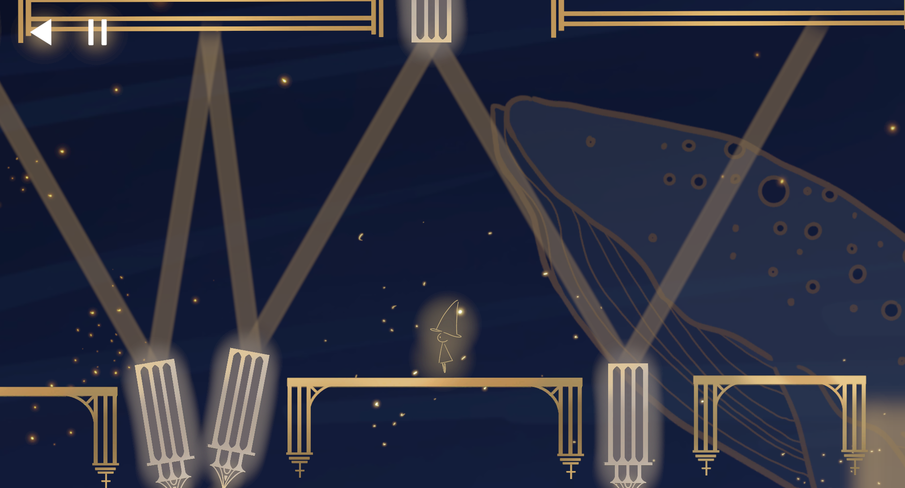
（示例：天空）

## 功能页面
主菜单：点击play开始游戏，点击exit退出程序，点击portal进入关卡选择页面  
关卡选择界面：可以进入天空、森林、梦境三个关卡。

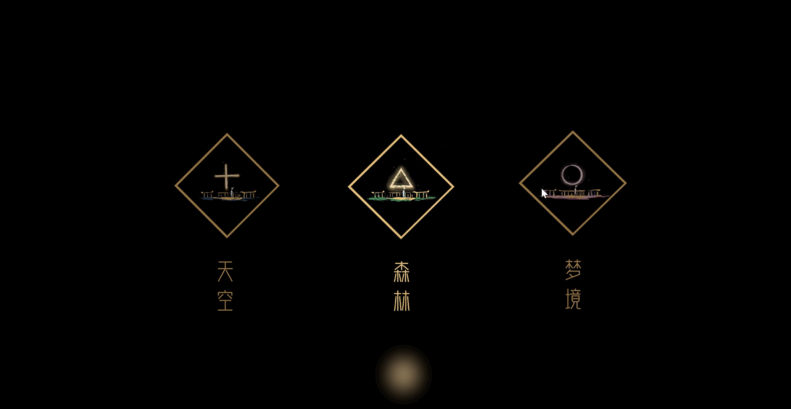
（示例：关卡选择界面）

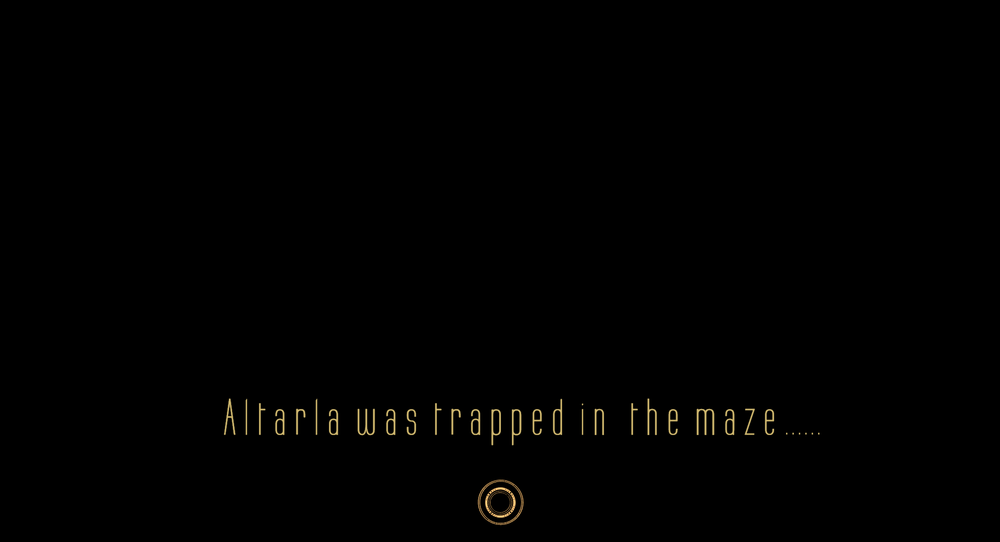
（示例：死亡界面）

## 游戏美术
**说明：除字体外美术资产皆为原创**  
美术风格：哥特复古，魔幻主义。  

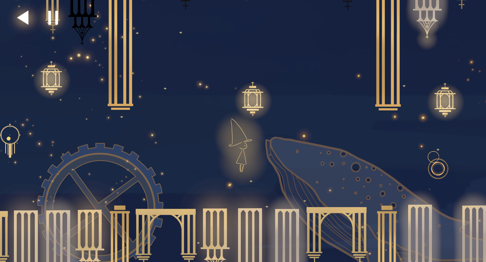
“天空”以黑-蓝-金为主色调，致力于构建广阔的空间感与精巧的设计感。  

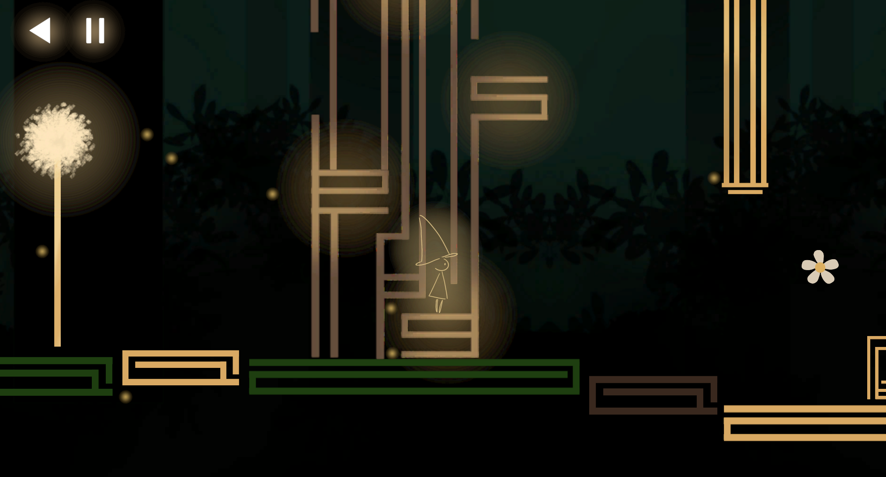
“森林”以黑-绿-棕-金为主色调，突出魔幻色彩与神秘色彩。  

“梦境”以黑-粉-紫-金为主色调，营造迷幻氛围。  

## 游戏音乐
**说明：音乐资产皆为原创**  
音乐风格：古典、轻音乐  
隐喻：  
天空：  
第一张地图中五个背景音乐由平淡至激烈再至平淡，与解谜的难度相适应。  
第一、二个背景音乐较简单，玩家只需要利用琴键复现音乐。  
第三个背景音乐的主旋律先升后降，寓意回环往复，提示玩家时钟的倒转音乐的作用。  
第四个背景音乐不断重复一段音乐，且每次重复中第二遍相比于第一遍缺失两个音，只要玩家将这两个缺失的音填补即可通关。  
第五个背景音乐不断由高音推至低音，寓意下降，玩家需要遵循迷宫由琴键组成的台阶不断向下走。在第三张地图中则反过来，玩家向上走时琴键组成的音不断变高，寓意上升和通关。 

例如：
背景音乐-天空-4：https://github.com/zr-zhou0o0/light/blob/main/Assets/music/bgm_room5%20with%20internal.mp3

森林：  
第一个背景音乐寓意森林的生机和危险。  
第二个背景音乐在玩家到达树冠时出现，较为安静，体现树丛茂密。以一高两低的三个音为一组反复出现，暗示琴键的8度需要调整，且应以高-低-低的顺序解谜。  

例如：
背景音乐-森林-1：https://github.com/zr-zhou0o0/light/blob/main/Assets/music/startForest2.mp3

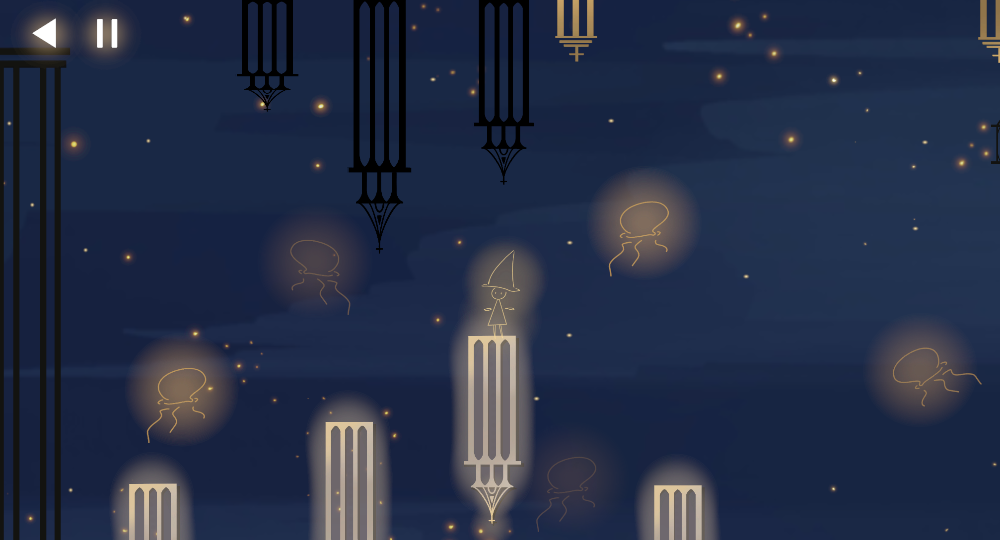
（示例：解谜过程）

## 分工情况
周子睿：音乐、美术、第一张地图程序与场景制作  
潘翠青：策划、第三张地图程序与场景制作  
蒋韵涵：策划、剧情、第二张地图程序与场景制作  

## 源代码构建方式  
Unity 编辑器：2022.3.17f1c1版本，打开文件夹，在Asset文件夹双击start场景作为开始页面，直接启动游戏。或者用unity-文件-生成设置-构建和运行。  
 

## 开发工具及版本
Unity 2022.3.17f1c1  
Visual Studio 2019  
Photoshop 2019cc  
FL Studio 20  
Procreate  

